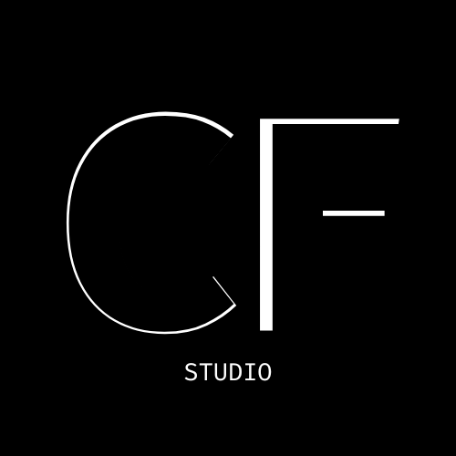

# CF-Space

yoo welcome to CF-Space

this is our logo btw

---

## What the hell are we making?

basically we're building a stupid little tech startup  
we're making Oculink stuff and whatever weird hardware we think is funny

---

## Why?

idk man  
i just found something called Oculink  
and thought "wow that's cool"  
so... yeah here we are

---

## Our Team

- Chin-x — founder & CEO  
yep that's literally it

---

## Our project?
[here](?p=project)

---

## Where can i get one?

idk bro  
we don't even have a prototype yet

---

## Q&A

- is it real? — yes  
- why? — yes  
- what's Oculink? — basically PCIe x4 but shaped like usb  
- should i have Oculink on my pc? — ofc  
- how do i get Oculink? — nvme → oculink or pcie x4 → oculink adapter
